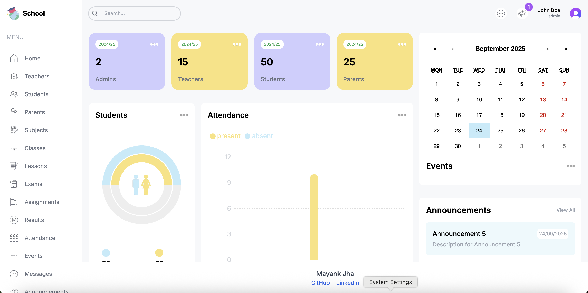
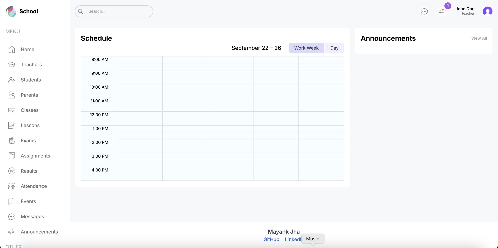
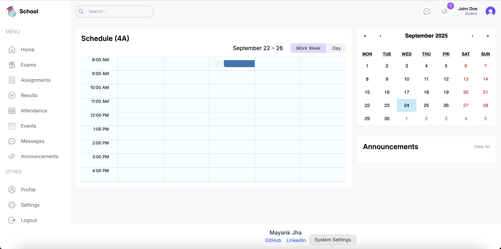
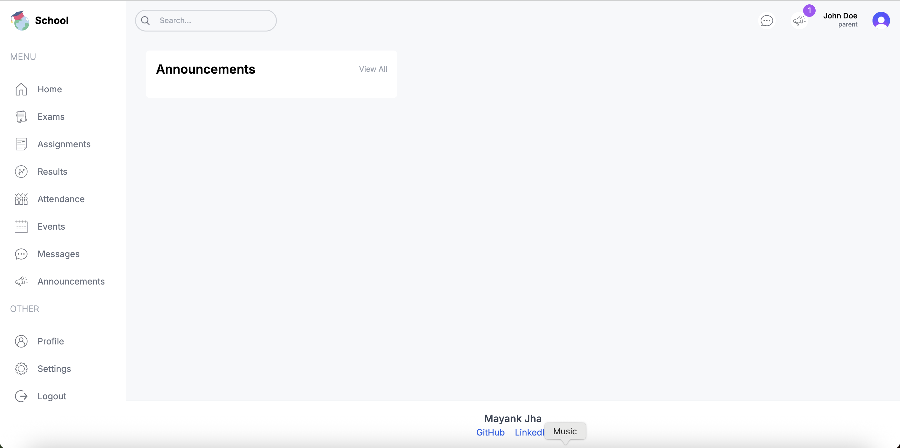

# 🏫 School Management Dashboard  

A full-stack school management application built with **Next.js** and modern web technologies.  
It provides separate dashboards and functionalities for **Admin**, **Teacher**, **Student**, and **Parent** roles – making school operations smooth and transparent.

---

## ✨ Features

### 🔑 Role-Based Access Control  

- **Admin**  
  - Manage **Teachers**, **Students**, **Parents**, **Grades**, **Classes**, and **Subjects**.  
  - Oversee **Lessons**, **Exams**, **Assignments**, **Events**, and **Announcements**.  
  - Full access to create, update, and delete all entities in the system.

- **Teacher**  
  - Linked to multiple **Subjects**, **Classes**, and **Lessons**.  
  - Can schedule **Exams** and create **Assignments** for their lessons.  
  - Record **Attendance** and manage **Results** for their students.  
  - View and supervise their assigned classes and students.

- **Student**  
  - Linked to a **Parent**, **Class**, and **Grade**.  
  - Can view their **Timetable (Lessons)**, **Exams**, **Assignments**, **Results**, and **Attendance**.  
  - Access to announcements and events for their class/grade.  

- **Parent**  
  - Connected to one or more **Students**.  
  - Can monitor their children’s **Attendance**, **Results**, **Assignments**, and overall academic progress.  
  - View class-level **Events** and **Announcements** relevant to their children.


- **Dynamic UI** – Each role sees a tailored interface with relevant features.  
- **Secure Authentication** – Role-based login with base credentials.  
- **Responsive Design** – Works seamlessly on desktop and mobile.  
- **REST APIs / Server-Side Rendering** – Fast, SEO-friendly, and scalable.

---

## 🖼️ Screenshots  

| Admin Dashboard | Teacher Dashboard | Student Dashboard | Parent Dashboard |
|-----------------|-------------------|-------------------|------------------|
|  |  |  |  |


---


### Clone the Repository
```bash
git clone https://github.com/getMayankJha/full-stack-school.git
cd school-management-dashboard

### Install Dependencies  
```bash
npm install
# or
yarn install
```

### Setup Environment Variables  

Create a `.env.local` file in the root directory and add your variables:  

```env
DATABASE_URL=your_database_url
JWT_SECRET=your_jwt_secret
NEXT_PUBLIC_CLERK_PUBLISHABLE_KEY=your_public_clerk_publishable_key
```

### Run the Development Server  
```bash
npm run dev
# or
yarn dev
# or
pnpm dev
```

Open [http://localhost:3000](http://localhost:3000) in your browser.

You can start editing the page by modifying `src/app/`. The page auto-updates as you edit the file.

---

## 🧑‍💻 Demo Credentials  

Use the following credentials to explore different dashboards:

| Role   | Email / Username|     Password      |
|--------|-----------------|-------------------|
| Admin  | admin1          | Admin@2024!Pass   |
| Teacher| teacher         | teacher@2024!Pass |
| Student| student         | student@2024!Pass |
| Parent | parent          | parent@2024!Pass  |


---

## 🛠️ Tech Stack  

- **Frontend:** Next.js (App Router), React, Tailwind CSS  
- **Backend:** Next.js API Routes   
- **Database:** PostgreSQL
- **Authentication:** NextAuth  
- **Deployment:** Vercel 
